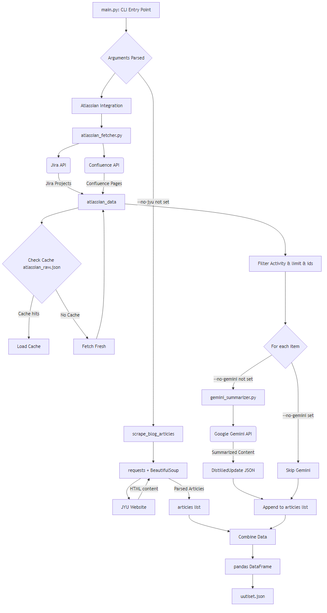
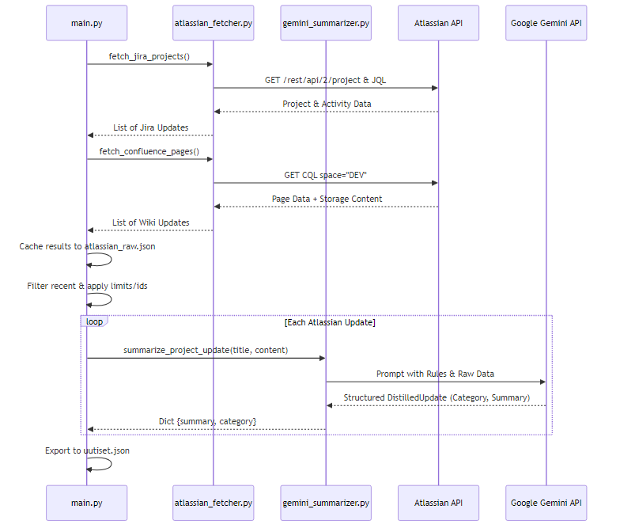

# Katsaus.AI Scraper

The scraper module is responsible for aggregating data from organizational sources (Jyväskylä University news, Jira projects, and Confluence pages) and summarizing them into structured, easy-to-read content for the Katsaus.AI frontend using Google's Gemini models.

## Table of Contents
- [Architecture](#architecture)
- [Setup & Configuration](#setup--configuration)
- [How to Run](#how-to-run)
- [Detailed Summarization Flow](#detailed-summarization-flow)

## Architecture

The script performs a lightweight ETL (Extract, Transform, Load) process. It fetches raw content, runs it through an AI distiller agent (`gemini_summarizer.py`), and saves the final result to `uutiset.json` (which acts as the database for the frontend).




## Setup & Configuration

Ensure your environment `.env` file at the project root contains the necessary API paths and credentials:

```env
ATLASSIAN_URL=https://your-domain.atlassian.net
ATLASSIAN_USERNAME=your.email@example.com
ATLASSIAN_API_TOKEN=your_token_here
GEMINI_API_KEY=your_gemini_key_here
```

## How to Run

To run the complete scraper pipeline:
```bash
python scraper/main.py
```

### CLI Configuration Flags

You can customize the execution to skip modules or limit fetching via CLI flags:

- `--no-gemini`: Skips the LLM summarization step. Falls back to raw Jira/Confluence previews. Useful if Gemini is rate limited or when testing.
- `--no-jyu`: Skips scraping the JYU websites.
- `--atlassian-limit <N>`: Limits the maximum number of Atlassian updates processed (default is `5`).
- `--atlassian-ids <ID1>,<ID2>`: A comma-separated list specifying exactly which Jira Keys (e.g. `PROJ-123`) or Confluence Page IDs to include.

## Detailed Summarization Flow

The Atlassian fetcher specifically looks for recent activity (within 7 days). Passing the raw HTML/text to the Gemini AI distils long-winded meeting notes or Jira tickets into concise, "Teletext-style" bullet points.


